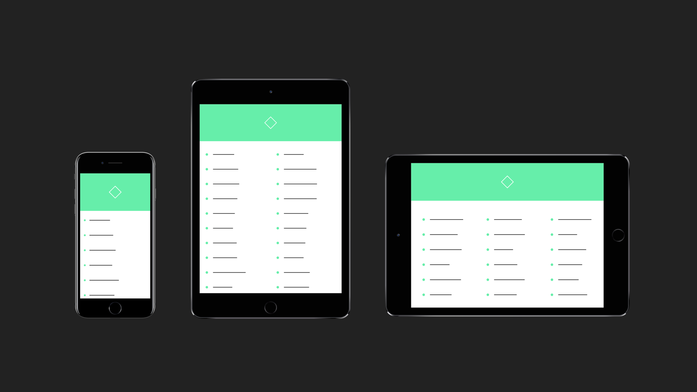

# Adapt for Framer

A small module for when you're designing across multiple devices and sizes. It does three things:


### 1. Simple breakpoint handling

Give your variables separate values for each breakpoint, and Adapt automatically retrieves the correct one when you need it. Like so:

```coffeescript
# Set breakpoints (by max screen width)
Adapt.setBreakpoints
	small: 400
	medium: 590
	large: 1000

# Let's say we want a different font size for each breakpoint
Adapt.fontSize =
	small: 12
	medium: 16
	large: 24
	other: 32

# Now we just use Adapt.fontSize throughout the prototype, and Adapt automatically fetches the correct value for us
text = new TextLayer
    fontSize: Adapt.fontSize
```


### 2. Automatic full screen on mobile

Regardless of which device you choose to present with on desktop, the prototype will run in full screen when you run it on mobile/tablet. Otherwise, you might see a picture of an iPhone in the middle of your iPad screen for example.


### 3. Pick device on the fly

Optionally, add a device picker drop-down to your prototype, so you and your clients can pick devices on the fly in your browser without editing and re-uploading the prototype.

To enable the device dropdown, just do this:

```coffeescript
Adapt.picker.enable()
```
Devices are organized into categories, which you can exclude from the list as needed:
```coffeescript
Adapt.picker.exclude "Apple Watch"
Adapt.picker.exclude "Other"
```


## Example

Here's an [example](https://framer.cloud/dirDC) to give you a basic idea. Use the controls in the top right corner to test different devices and orientations.


## Adding Adapt

Adapt is not a class, so just require it and you're good to go.

```coffeescript
{Adapt} = require "Adapt"
```


## Compatibility

Adapt uses a JavaScript Proxy object to achieve its syntax. Notably, this is only supported since iOS 10. For a full compatibility table, please check [http://caniuse.com/#feat=proxy](http://caniuse.com/#feat=proxy).


## Documentation

### Adapt.setBreakpoints(_obj_)
Takes an object where each key is given a numeric value representing the max screen width the breakpoint applies to:

```coffeescript
Adapt.setBreakpoints
	small: 400
	medium: 590
	large: 1000
```

### Adapt.check()
Returns the name of the current breakpoint. In the example above, `Adapt.check()` would return `"small"` on an iPhone 7 in portrait mode, for example. If none of the breakpoints fit (screen is wider than 1000dp in our example), it returns "other".

### Adapt.evaluator()
This is the function that tells "check" which breakpoint to return. You can overwrite this function if you want to use some custom criteria. Just make sure it returns a string which corresponds to the keys you use to define your variables. Otherwise, `Adapt.check()` will return `"other"`.

Let's say you want to check the screen height instead of the simple max width breakpoints provided by `Adapt.setBreakpoints()`:
```coffeescript
# Just write our own evaluator function
Adapt.evaluator = ->
	if Screen.height < 500
		return "compact"
	else
		return "normal"

# Now let's set a variable that tells us whether the header should be shown
Adapt.showHeader =
	normal: true
	compact: false

# Adapt.showHeader will return false on compact screens
myHeader.visible = Adapt.showHeader
```


### Adapt.picker.enable()

Enable device picker dropdown on desktop.


### Adapt.picker.disable()

Disable device picker. The device picker is disabled by default.


### Adapt.picker.exclude(_groupName_)

Remove a group of devices from the device list based on group name (as seen in the dropdown with # in front):

```
Adapt.picker.exclude("iPhone")
Adapt.picker.exclude("iPad")
```

### Adapt.picker.include(_groupName_)

Include a group of devices that has been excluded. All devices are included by default.

## Requests or suggestions?

Please don't hesitate to get in touch or file an issue if you have any feedback or use cases you'd like to see covered. The most efficient way to reach me is probably via the Framer Slack, which you can sign up for at [https://framer-slack-signup.herokuapp.com/](https://framer-slack-signup.herokuapp.com/).

